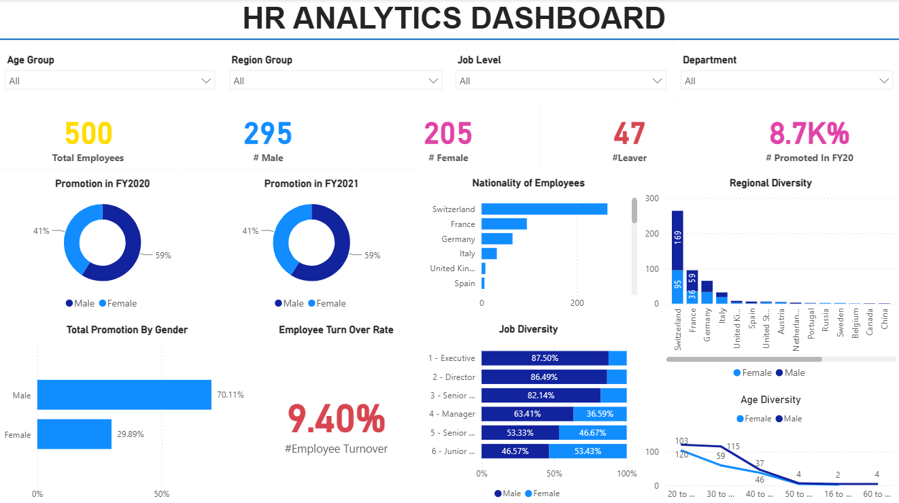
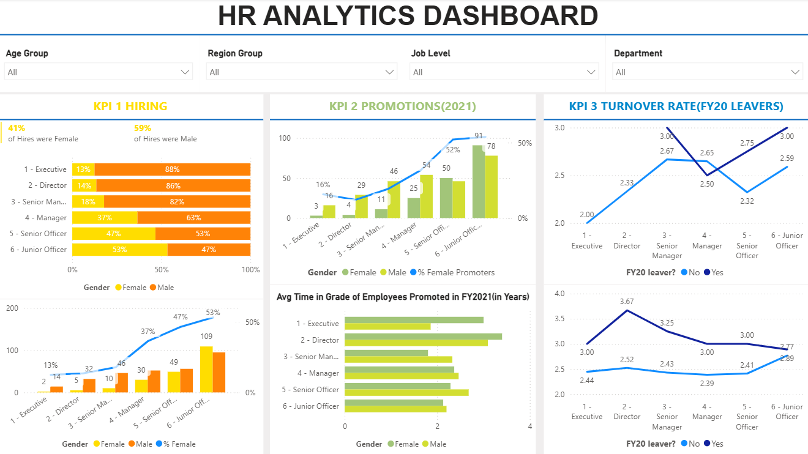
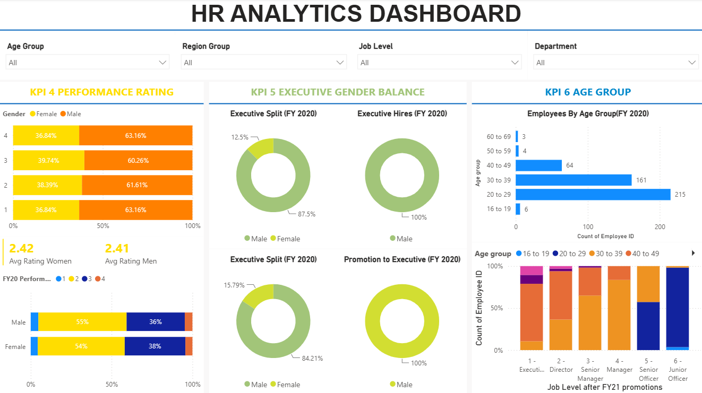

# 👥 HR Analytics Dashboard using Power BI

An interactive **Power BI dashboard** built to give HR teams and leadership a clear view of workforce composition, diversity, hiring, promotions, turnover, and performance — all filterable by age group, region, job level, and department.

🔗 **Repository:** [HR-Analytics-Dashboard-using-PowerBI](https://github.com/niharikakt024/HR-Analytics-Dashboard-using-PowerBI)

---

## 🖥️ Dashboard Preview

### 1. Overview
Headline workforce metrics — total employees, gender split, leavers, and promotions — alongside promotion trends by gender, employee turnover rate, nationality mix, job-level diversity, and regional/age diversity breakdowns.



### 2. KPIs — Hiring, Promotions & Turnover
Deep dive into **Hiring** (gender split by job level), **Promotions in 2021** (by job level and gender, with % female promoters and average time in grade), and **Turnover Rate** (FY20 leavers by job level and gender).



### 3. KPIs — Performance, Executive Balance & Age Group
Covers **Performance Rating** by gender and rating band, **Executive Gender Balance** (executive split, hires, and promotions to executive), and **Age Group** distribution of employees and post-promotion job levels.



---

## ✨ Key Features

- **Interactive Slicers** — Filter by Age Group, Region Group, Job Level, and Department
- **Workforce Snapshot** — Total employees, male/female count, leavers, and FY20 promotions
- **Diversity Analysis** — Nationality, job-level, regional, and age diversity breakdowns
- **Promotion Tracking** — Promotion rate by gender across job levels, plus average time in grade
- **Turnover Insights** — FY20 leaver rate segmented by job level and gender
- **Hiring Analysis** — New hire gender split by job level
- **Performance Ratings** — Average rating comparison between male and female employees
- **Executive Gender Balance** — Executive split, hires, and promotion-to-executive by gender
- **Age Group Distribution** — Headcount and post-promotion job levels by age band

---

## 🛠️ Tech Stack

- **Tool:** Microsoft Power BI Desktop
- **Data Modeling:** Star schema with employee, department, and job-level dimension tables
- **DAX:** Custom measures for turnover rate, promotion %, and gender/age distribution
- **Data Source:** Employee master and HR transactional data (hires, promotions, exits, performance ratings)

---

## 📁 Repository Structure

```
HR-Analytics-Dashboard-using-PowerBI/
│
├── HR Analytics Dashboard.pbix          # Power BI dashboard file
├── Dataset.xlsx                   # Source data files (if included)
├── Dashboard.png            # Dashboard preview images
├── KPI's 1.png
├── KPI's 2.png
└── README.md                # Project documentation
```

---

## 🚀 Getting Started

1. Clone the repository
   ```bash
   git clone https://github.com/niharikakt024/HR-Analytics-Dashboard-using-PowerBI.git
   ```
2. Open the `.pbix` file in **Power BI Desktop**
3. Refresh the data source (if connected to live data)
4. Explore the report pages: **Overview**, **Hiring / Promotions / Turnover KPIs**, and **Performance / Executive Balance / Age Group KPIs**

---

## 📈 Key Insights

- The workforce totals **500 employees**, with a **59% male / 41% female** split
- Employee turnover rate stands at **9.40%**, with **47 leavers** recorded
- Executive and Director-level promotions skew heavily male (**~86–87%**), highlighting a gender gap at senior levels
- **Switzerland** is the largest nationality group among employees, followed by France and Germany
- The majority of the workforce falls in the **20–39 age range**, with promotion activity concentrated in the same bands
- Average performance ratings are nearly identical between men (**2.41**) and women (**2.42**), showing no significant rating gap

---

## 👤 Author

**Niharika K T**
GitHub: [@niharikakt024](https://github.com/niharikakt024)

---

⭐ If you find this project useful, consider giving the repository a star!
